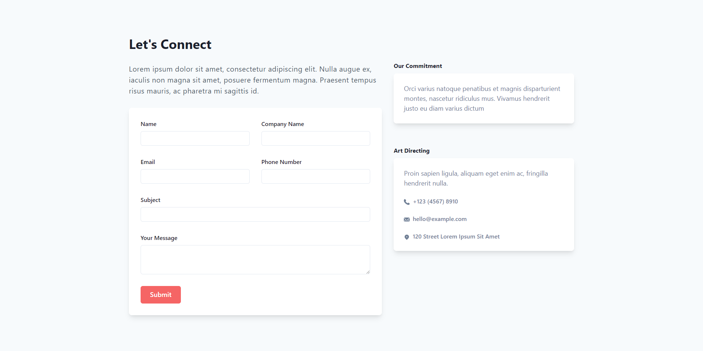
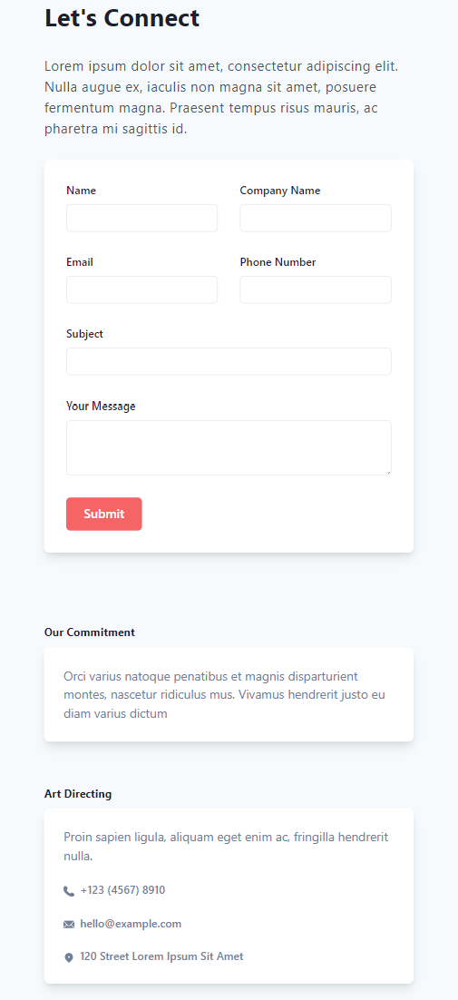
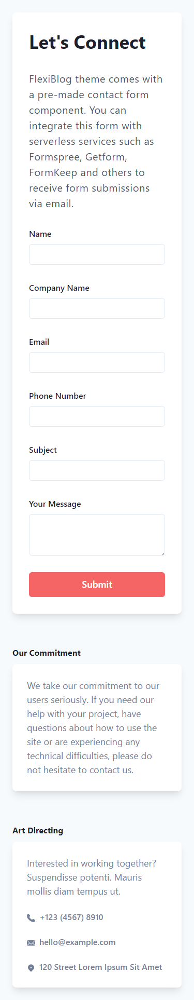

# Página Responsiva Chakra UI

Projeto desenvolvido para o teste da vaga de estágio em Desenvolvimento Front End na empresa Ecto Digital.
O desafio foi fazer uma página responsiva conforme layout do figma disponibilizado.

# Índice

* [Tecnologias usadas](#tecnologias-usadas)
* [Design Figma](#design-figma)
* [Imagem do projeto](#imagem-do-projeto)
* [Deploy](#deploy)
* [Rodando o Projeto](#rodando-o-projeto)

## Tecnologias usadas:

- ``React.js``
- ``Next.js``
- ``Chakra UI`` <https://chakra-ui.com/>

## Design Figma:

- Link para acessar o design disponibilizado: <https://www.figma.com/file/M1Zjk4AKNWNUhAMtoNYd0c/Teste-de-est%C3%A1gio-(Dev)-(Copy)?node-id=0%3A1&t=noKsZJDlrdIT4dl4-1>

## Imagem do projeto:

## Deploy:

- ``Vercel`` | Link: <https://test-frontend-ecto-paulajardimf.vercel.app/>

## Rodando o projeto:
- Rode o console na pasta em que você baixou os arquivos;

- Insira o comando ``npm install``;

- Depois, o comando ``npm run dev`` para rodar no navegador.
